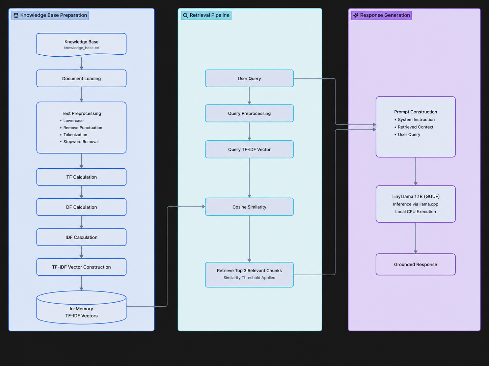

# RAGnarok

::: {align="center"}


 


### A Lightweight Offline Retrieval-Augmented Generation (RAG) System built from scratch in C++
:::

------------------------------------------------------------------------

## Overview

**RAGnarok** is my attempt to understand how Retrieval-Augmented
Generation (RAG) works internally instead of relying on high-level AI
frameworks.

The project is implemented primarily in **C++**, uses **TF-IDF** and
**Cosine Similarity** for retrieval, and integrates **TinyLlama**
locally through **llama.cpp**. The complete pipeline runs offline on CPU
and is designed to be lightweight and easy to understand.

> **Note:** This is an educational project under active development. My
> focus is understanding the core mechanics of RAG, and I'll continue
> improving it as I get more time.

------------------------------------------------------------------------

## Features

-   Offline Retrieval-Augmented Generation (RAG)
-   Pure C++ implementation
-   TF-IDF document retrieval
-   Cosine Similarity search
-   Document chunking
-   Local TinyLlama inference using llama.cpp
-   Source attribution
-   CPU-only execution
-   Interactive CLI

------------------------------------------------------------------------

## Architecture

## 🏗️ Architecture

<p align="center">
  
</p>

The diagram below illustrates the complete offline Retrieval-Augmented Generation (RAG) pipeline implemented in RAGnarok, from knowledge base preparation to retrieval and local response generation using TinyLlama.

``` text
User Query
    │
    ▼
Preprocessing
    │
    ▼
TF-IDF Retrieval
    │
    ▼
Top Relevant Chunks
    │
    ▼
Prompt Construction
    │
    ▼
TinyLlama (llama.cpp)
    │
    ▼
Generated Answer
```

------------------------------------------------------------------------

## Project Structure

``` text
RAGnarok
├── config
│   └── config.txt
├── data
│   ├── knowledge_base.txt
│   ├── pdfs
│   └── prompt.txt (generated)
├── include
│   └── preprocessing.h
├── src
│   ├── main.cpp
│   └── preprocessing.cpp
├── README.md
└── .gitignore
```

------------------------------------------------------------------------

## Tech Stack

  Component     Technology
  ------------- ---------------------
  Language      C++17
  Retrieval     TF-IDF
  Similarity    Cosine Similarity
  LLM Runtime   llama.cpp
  Model         TinyLlama 1.1B GGUF
  Execution     CPU

------------------------------------------------------------------------

## How it Works

1.  Load the knowledge base.
2.  Preprocess and tokenize text.
3.  Build TF-IDF vectors.
4.  Process the user's query.
5.  Retrieve the most relevant chunks.
6.  Build a grounded prompt.
7.  Generate an answer locally using TinyLlama.

------------------------------------------------------------------------

## Installation

### Prerequisites

-   Windows
-   MinGW g++
-   llama.cpp
-   TinyLlama GGUF model

### Compile

``` bash
g++ src/main.cpp src/preprocessing.cpp -o build/test.exe
```

### Run

``` bash
build\test.exe
```

------------------------------------------------------------------------

## Challenges

-   Integrating llama.cpp on Windows
-   Prompt construction
-   Retrieval threshold tuning
-   Building the retrieval pipeline from scratch in C++

------------------------------------------------------------------------

## Current Limitations

-   TF-IDF is lexical rather than semantic.
-   Designed for a small knowledge base.
-   CLI interface only.
-   Single knowledge base workflow.

------------------------------------------------------------------------

## Roadmap

Planned improvements include:

-   Better chunking strategy
-   Multi-document support
-   Semantic retrieval
-   Improved prompt templates
-   Cleaner project modularization
-   Better terminal output

These are features I plan to add gradually as I continue learning and
get more time to work on the project.

------------------------------------------------------------------------

## Learning Outcomes

Through this project I gained hands-on experience with:

-   Retrieval-Augmented Generation
-   Information Retrieval
-   TF-IDF
-   Cosine Similarity
-   Prompt grounding
-   Local LLM inference
-   llama.cpp integration

------------------------------------------------------------------------

## Acknowledgements

-   llama.cpp
-   TinyLlama
-   Open-source AI community

------------------------------------------------------------------------

## Author

**Saurav Chakraborty**

B.Tech Student

------------------------------------------------------------------------

If you found the project interesting, feel free to star the repository
or share feedback. Contributions and suggestions are always welcome.
